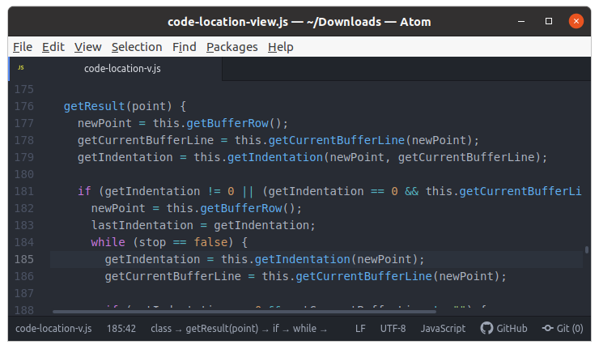
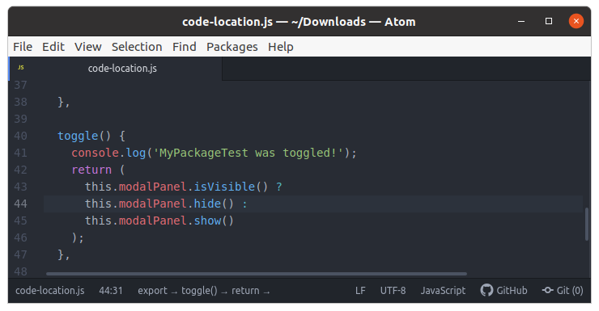
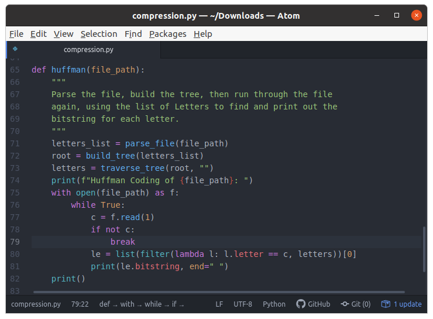

# code-location : a package for `atom` editor

*code-location* is a tool that lets you know where you are in your code, by showing you your location (class, function, etc.) 
in the status bar of the Atom editor.
*code-location* works by analyizing the indentation of the edited file.
Use a code beautifier to make sure your indentation is correct. If the indentation is wrong, *code-location* might not work well.

# Example JavaScript

Editor:

Status-bar:

`class` :arrow_right: `getResult(point)` :arrow_right: `if` :arrow_right: `while` 

As seen in this example, the current cursor is inside a `class`, then within a function called `getResult()`, therein 
inside an `if`, and lastly inside a `while` loop.

# Example JavaScript

# Example Python

# Features
- You can more easily understand where you are in your code. So there is less chance you get confused about your location in complicated code.
- You can see how much your current line is indented (indentation count).

# How to install

- Via the atom package manager (`apm`):
  - `apm install code-location`
- Or inside the `atom` editor, on the Settings page (Control-,), on the install tab.
- Or from `atom.io` website
  - https://atom.io/packages/code-location

# Package for `atom`

